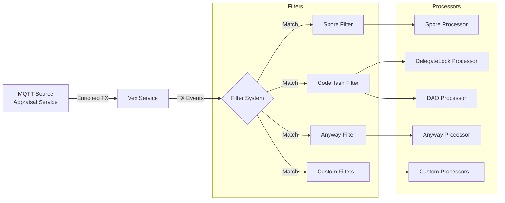

# Vex - Transaction Event Processing Framework for CKB, Powered by Appraisal

[](https://opensource.org/licenses/MIT)


A flexible and extensible framework for processing CKB transaction events(enriched by another project called [Appraisal](https://github.com/nervape/appraisal.git)). Built with TypeScript, it provides a plugin-based architecture for filtering and processing transactions based on configurable rules.

## Features

- **Plugin Architecture**: Easy-to-extend filter and processor system
- **Configurable Rules**: YAML-based configuration for transaction filtering
- **MQTT Integration**: Subscribe to transaction events from CKB nodes
- **Type Safety**: Full TypeScript support with strict typing
- **Error Handling**: Comprehensive error handling with retries
- **Logging**: Detailed logging with Winston

## Architecture



## Prerequisites

- Node.js >= 18.0.0
- npm >= 9.0.0
- MQTT Broker(You may already setted up if you have Appraisal running)
- [Appraisal](https://github.com/nervape/appraisal.git)

## Installation

```bash
# Clone the repository
git clone https://github.com/nervape/vex.git
cd vex

# Install dependencies
npm install

# Build the project
npm run build
```

## Configuration

Configuration is managed through YAML files in the `config` directory:

```yaml
mqtt:
  host: "localhost"
  port: 1883
  clientId: "vex-processor"
  topic: "ckb.transactions.proposed.detailed"
  reconnectPeriod: 1000
  qos: 1

filters:
  - name: "dao-tracker"
    filter: "codeHash"
    codeHash: "0x82d76d1b75fe2fd9a27dfbaa65a039221a380d76c926f378d3f81cf3e7e13f2e"
    processor: "dao"

  - name: "all-transactions"
    filter: "anyway"
    processor: "anyway"

retry:
  maxAttempts: 3
  initialDelay: 1000
  maxDelay: 5000
```

## Extending the Framework

### Creating a New Filter

```typescript
import { BaseFilter } from "./base";
import { FilterConfig } from "../types/config";
import { Transaction } from "../types/transaction";

export class CustomFilter extends BaseFilter {
    constructor(name: string, config: CustomFilterConfig) {
        super(name, config);
    }

    matches(tx: Transaction): boolean {
        // Implement your filtering logic
        return true;
    }
}
```

### Creating a New Processor

```typescript
import { BaseProcessor } from "../base";
import { Transaction } from "../../types/transaction";
import logger from "../../utils/logger";

export class CustomProcessor extends BaseProcessor {
    constructor() {
        super("custom");
    }

    async process(tx: Transaction): Promise<void> {
        // Implement your processing logic
        logger.info(`Processing transaction: ${tx.hash}`);
    }
}
```

## Usage

### Development Mode

```bash
npm run dev
```

### Production Mode

```bash
npm run build
npm start
```

### Environment Variables

- `MQTT_HOST`: MQTT broker host
- `MQTT_PORT`: MQTT broker port
- `MQTT_TOPIC`: Transaction event topic
- `LOG_LEVEL`: Logging level (default: info)

## Project Structure

```
vex/
├── src/
│   ├── filters/        # Transaction filters
│   ├── processors/     # Transaction processors
│   ├── types/         # TypeScript type definitions
│   ├── services/      # Core services
│   └── utils/         # Utility functions
├── config/           # Configuration files
└── test/            # Test files
```

## Contributing

1. Fork the repository
2. Create your feature branch (`git checkout -b feature/amazing-feature`)
3. Commit your changes (`git commit -m 'Add some amazing feature'`)
4. Push to the branch (`git push origin feature/amazing-feature`)
5. Open a Pull Request

## Copyrights

- **Code Monad** - *Initial work* - [code@nervape.com](mailto:code@nervape.com)
- **Nervape Studio** - [https://www.nervape.com](https://www.nervape.com)

## License

This project is licensed under the MIT License - see the [LICENSE](LICENSE) file for details.

## Acknowledgments

- CKB Team for the blockchain platform
- MQTT Protocol for reliable event delivery
- TypeScript community for excellent tooling

---

For more information, please contact the authors or visit the Nervape website.
